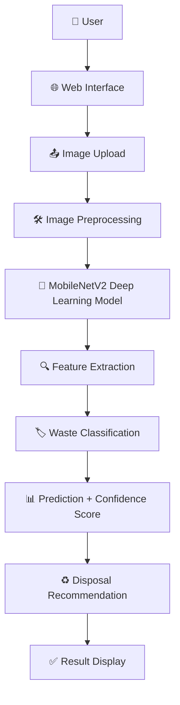
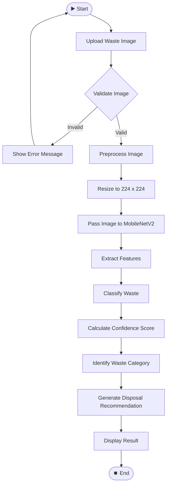

# ♻️ Smart Waste Classification & Disposal Recommendation System

### AI-Powered Waste Identification using Computer Vision and Deep Learning

[](https://www.python.org/)
[](https://www.tensorflow.org/)
[](https://flask.palletsprojects.com/)
[](#)
[](#)

---

## 📌 Project Banner / Short Introduction

**Smart Waste Classification & Disposal Recommendation System** is an AI/ML-based web application that identifies the category of waste from an uploaded image and recommends the appropriate disposal method. The system leverages **Convolutional Neural Networks (CNNs)** and **Transfer Learning** using the **MobileNetV2** architecture to classify waste into six categories — Plastic, Paper, Metal, Glass, Organic, and E-Waste — helping users dispose of waste responsibly and promoting sustainable waste management practices.

This project was developed by **Team NEURO** as part of a hackathon initiative at **Erode Sengunthar Engineering College**.

---

## 🧩 Problem Statement

Improper waste segregation is one of the leading causes of inefficient recycling and environmental pollution. Most individuals lack the knowledge to correctly identify which category a waste item belongs to and how it should be disposed of.

This project aims to **develop a computer-vision-based system that identifies the category of waste from an uploaded image and recommends the appropriate disposal method**, thereby simplifying the waste segregation process for everyday users.

---

## 🎯 Project Objectives

- To build an image classification model capable of identifying waste into predefined categories.
- To apply **transfer learning** using a lightweight, efficient CNN architecture (MobileNetV2).
- To develop a simple, user-friendly web interface for image upload and result display.
- To provide a **confidence score** along with each prediction for transparency.
- To generate a **disposal recommendation** based on the predicted waste category.
- To create a scalable foundation for future smart-waste-management solutions.

---

## 💡 Proposed Solution

The proposed system allows a user to upload an image of a waste item through a web interface. The image is preprocessed and passed through a **MobileNetV2-based deep learning model** that has been fine-tuned using transfer learning on a labeled waste dataset. The model predicts the most probable waste category along with a confidence score, and the system maps this prediction to a suitable disposal recommendation, which is displayed back to the user.

---

## ✨ Key Features

| Feature | Description |
|---|---|
| 📤 Image Upload | Users can upload an image of a waste item through the web interface |
| 🧠 Image Classification | Deep learning model classifies the waste into one of six categories |
| 🏷️ Waste Category Prediction | Displays the predicted waste type clearly |
| 📊 Confidence Score | Shows the model's confidence percentage for the prediction |
| ♻️ Disposal Recommendation | Suggests the correct disposal method based on the predicted category |
| 🌐 Web-Based Interface | Simple and accessible HTML/CSS/JS front end powered by Flask |

---

## 🗂️ Waste Categories

| # | Category | Example Items |
|---|---|---|
| 1 | 🧴 Plastic | Bottles, containers, wrappers |
| 2 | 📄 Paper | Newspapers, cardboard, books |
| 3 | 🥫 Metal | Cans, foil, scrap metal |
| 4 | 🍾 Glass | Bottles, jars, broken glass |
| 5 | 🍂 Organic | Food waste, garden waste |
| 6 | 💻 E-Waste | Batteries, circuit boards, electronics |

---

## 🏗️ System Architecture

The system follows a linear pipeline where the uploaded image passes through preprocessing, feature extraction, and classification stages before generating the final disposal recommendation.

---

## 🖼️ Architecture Diagram



---

## 🔄 System Flowchart



---

## ⚙️ Detailed Working Process

1. **User Interaction:** The user accesses the web application and uploads an image of a waste item.
2. **Validation:** The system checks whether the uploaded file is a valid image format.
3. **Preprocessing:** The image is resized to `224 × 224` pixels and normalized to match the input requirements of MobileNetV2.
4. **Model Inference:** The preprocessed image is passed through the MobileNetV2-based CNN model.
5. **Feature Extraction:** The model extracts spatial and visual features (edges, textures, shapes, colors) from the image.
6. **Classification:** A softmax classification layer predicts the probability distribution across the six waste categories.
7. **Confidence Score:** The highest probability value is converted into a confidence percentage.
8. **Category Identification:** The category with the highest probability is selected as the final prediction.
9. **Disposal Recommendation:** Based on the predicted category, a corresponding disposal instruction is retrieved and displayed.
10. **Result Display:** The predicted category, confidence score, and disposal recommendation are shown to the user on the web page.

---

## 🛠️ Technology Stack

### Programming Language
| Technology | Purpose |
|---|---|
| Python | Core language for model development and backend |

### AI / ML
| Technology | Purpose |
|---|---|
| Computer Vision | Image understanding and analysis |
| Deep Learning | Learning visual patterns from data |
| Convolutional Neural Network (CNN) | Core architecture for image classification |
| Transfer Learning | Reusing a pretrained model for faster, efficient training |

### Deep Learning Model
| Model | Purpose |
|---|---|
| MobileNetV2 | Lightweight CNN backbone used for feature extraction and classification |

### Frameworks / Libraries
| Library | Purpose |
|---|---|
| TensorFlow | Deep learning framework |
| Keras | High-level API for building and training the model |
| NumPy | Numerical computations and array handling |
| Pillow (PIL) | Image loading and preprocessing |
| Flask | Backend web framework and API |

### Frontend
| Technology | Purpose |
|---|---|
| HTML | Page structure |
| CSS | Styling and layout |
| JavaScript | Client-side interactivity |

### Backend
| Technology | Purpose |
|---|---|
| Flask | Handles routing, image upload, and model inference requests |

### Development Tools
| Tool | Purpose |
|---|---|
| Visual Studio Code | Code editor / IDE |
| Git | Version control |
| GitHub | Repository hosting and collaboration |

---

## 🧠 AI/ML Model Explanation

### 🔹 What is a CNN?
A **Convolutional Neural Network (CNN)** is a class of deep learning models specifically designed to process image data. It uses convolutional layers to automatically learn spatial features such as edges, textures, shapes, and patterns directly from pixel data, eliminating the need for manual feature engineering.

### 🔹 What is Transfer Learning?
**Transfer learning** is a technique where a model that has already been trained on a large dataset (such as ImageNet) is reused as a starting point for a new, related task. Instead of training a CNN from scratch — which requires large datasets and significant computational resources — the pretrained network's learned features are fine-tuned on a smaller, task-specific dataset (in this case, waste images).

### 🔹 What is MobileNetV2?
**MobileNetV2** is a lightweight, efficient CNN architecture developed by Google, designed for mobile and resource-constrained environments. It uses **depthwise separable convolutions** and **inverted residual blocks with linear bottlenecks** to significantly reduce the number of parameters and computations compared to traditional CNNs, while maintaining strong accuracy.

### 🔹 Why MobileNetV2 is Used
- ⚡ **Lightweight and fast** — suitable for real-time or near real-time web-based inference.
- 📦 **Small model size** — easier to deploy on limited-resource servers or edge devices.
- 🎯 **Pretrained on ImageNet** — provides strong general-purpose visual feature extraction.
- 🔁 **Well-suited for transfer learning** — its convolutional base can be reused effectively for custom classification tasks like waste sorting.
- 🧩 **Good accuracy-to-efficiency trade-off**, making it practical for a hackathon-scale project with limited training data and compute.

### 🔹 Input Image Size
Images are resized to **224 × 224 pixels** (3 color channels — RGB) before being fed into the model, as this is the standard input dimension expected by MobileNetV2.

### 🔹 Feature Extraction
The convolutional base of MobileNetV2 processes the input image through a series of convolutional and pooling layers, progressively extracting higher-level visual features — from simple edges in early layers to complex object-level patterns in deeper layers.

### 🔹 Softmax Classification
The extracted features are passed to a custom classification head consisting of dense (fully connected) layers, ending in a **softmax layer**. The softmax function converts the raw output scores into a probability distribution across the six waste categories, where all probabilities sum to 1.

### 🔹 Confidence Score
The **confidence score** represents the probability assigned by the softmax layer to the predicted (highest-probability) class, expressed as a percentage. It indicates how certain the model is about its prediction — a higher confidence score suggests stronger certainty, while a lower score may indicate ambiguity in the image.

> ⚠️ **Note:** This project uses MobileNetV2 via transfer learning. The model must be trained using `train.py` on a suitable dataset before it can generate real predictions. No pretrained weights or accuracy figures for the waste classification task are included by default in this repository.

---

## 📁 Dataset Structure

The model is trained using a labeled image dataset organized by category, split into training and validation sets:

```
dataset/
├── train/
│   ├── plastic/
│   ├── paper/
│   ├── metal/
│   ├── glass/
│   ├── organic/
│   └── e_waste/
│
└── val/
    ├── plastic/
    ├── paper/
    ├── metal/
    ├── glass/
    ├── organic/
    └── e_waste/
```

> 📌 Each subfolder should contain images belonging only to that specific waste category. The dataset is not included in this repository and must be sourced or collected separately.

---

## 📂 Project Folder Structure

```
Smart_Waste_Classification/
│
├── app.py                     # Flask application entry point
├── train.py                   # Model training script
├── requirements.txt           # Python dependencies
├── README.md                  # Project documentation
│
├── app/
│   ├── model/
│   │   ├── waste_classifier.keras   # Trained model file (generated after training)
│   │   └── class_names.json         # Mapping of class indices to category names
│   │
│   ├── templates/
│   │   └── index.html               # Web interface
│   │
│   └── static/
│       └── uploads/                 # Stores user-uploaded images
│
└── dataset/
    ├── train/
    └── val/
```

---

## 💻 Installation

Clone the repository and install the required dependencies:

```bash
git clone https://github.com/vishnuaiml/ksr-hack.git
```

```bash
cd ksr-hack
```

```bash
python -m pip install -r requirements.txt
```

---

## ▶️ How to Run

### Step 1: Train the Model
Before running the application, the model must be trained on the waste dataset:

```bash
python train.py
```

This script trains the MobileNetV2-based classifier on the images inside `dataset/train/` and `dataset/val/`, and saves the trained model to `app/model/waste_classifier.keras`.

### Step 2: Run the Application

```bash
python app.py
```

### Step 3: Access the Web Application
Once the Flask server starts, open your browser and navigate to:

```
http://127.0.0.1:5000
```

You can now upload a waste image and view the classification result along with the disposal recommendation.

---

## 📤 Expected Output

Upon uploading an image, the system displays a result similar to the following:

```
Prediction: Plastic
Confidence: XX%

Recommended Disposal:
Separate the plastic item and send it to a plastic recycling
or authorized collection point.
```

> ℹ️ `XX%` is an illustrative placeholder. The actual confidence value will depend on the trained model and the uploaded image.

---

## 🖼️ Example Prediction

| Input | Predicted Category | Confidence | Recommended Disposal |
|---|---|---|---|
| 🧴 Plastic bottle image | Plastic | XX% | Send to plastic recycling / authorized collection point |
| 📄 Cardboard image | Paper | XX% | Send to paper recycling |
| 🥫 Metal can image | Metal | XX% | Send to metal recycling |

### ♻️ Disposal Recommendation Table

| Predicted Category | Recommended Disposal Method |
|---|---|
| 🧴 Plastic | Send to plastic recycling / authorized collection point |
| 📄 Paper | Send to paper recycling |
| 🥫 Metal | Send to metal recycling |
| 🍾 Glass | Send to glass recycling |
| 🍂 Organic | Composting / organic waste collection |
| 💻 E-Waste | Send to authorized e-waste recycling center |

---

## ✅ Advantages

- Simplifies waste segregation for non-technical users.
- Reduces manual effort and human error in waste identification.
- Promotes environmentally responsible disposal practices.
- Lightweight model (MobileNetV2) enables fast predictions with lower computational cost.
- Easily extensible to additional waste categories or smart-device integration.
- Provides transparency to users through confidence scores.

---

## 🚀 Future Enhancements

- 📷 Real-time camera-based waste detection
- 🔍 Multiple-object waste detection in a single image
- 📱 Dedicated mobile application
- 🗑️ Smart dustbin integration
- 🌐 IoT integration for automated waste tracking
- 📍 Recycling center recommendation based on user location
- ☁️ Cloud deployment for wider accessibility
- 🔬 Explainable AI (Grad-CAM) to visualize model decision-making
- 🤖 Automatic waste sorting mechanism integration

---

## 🌍 Social / Environmental Impact

Improper waste disposal contributes significantly to landfill overflow, pollution, and inefficient recycling systems. By helping individuals correctly identify and segregate waste, this project aims to:

- Encourage responsible waste disposal habits among the public.
- Improve the efficiency of recycling processes by reducing contamination from mixed waste.
- Support broader environmental sustainability and smart-city waste management initiatives.
- Raise awareness about the importance of segregating hazardous waste, such as e-waste.

---

## 👥 Team Details

**Team Name: NEURO**

| Name | Role |
|---|---|
| VISHNU C | Team Member |
| DHANVANDH S | Team Member |
| KAVIPRAKASH P | Team Member |
| NANDHA KISHORE SV | Team Member |

---

## 🏫 College Details

**Erode Sengunthar Engineering College**

---

## 🔗 GitHub Repository

🔗 [https://github.com/vishnuaiml/ksr-hack](https://github.com/vishnuaiml/ksr-hack)

---

## 📝 Conclusion

The **Smart Waste Classification & Disposal Recommendation System** demonstrates how computer vision and deep learning, specifically transfer learning with MobileNetV2, can be applied to address a real-world environmental challenge — waste segregation. By combining an efficient CNN-based classification pipeline with a simple, accessible web interface, this project provides a practical foundation for promoting responsible waste disposal. With further enhancements such as IoT integration, real-time detection, and mobile deployment, this system has the potential to evolve into a comprehensive smart waste management solution.

---

<p align="center">Developed with ♻️ by <b>Team NEURO</b> | Erode Sengunthar Engineering College</p>
